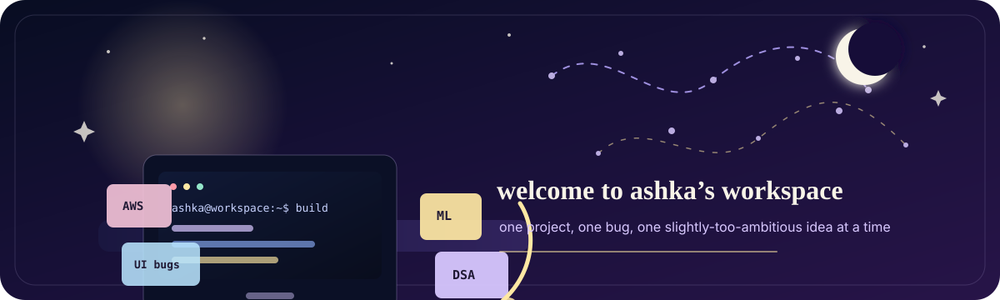

<p align="center">
  <strong>B.Tech ICT @ DAIICT · BS Data Science @ IIT Madras</strong><br>
  currently building my way through full-stack, data, cloud, and machine learning.
</p>

```console
ashka@github:~$ whoami
B.Tech ICT @ DAIICT · BS Data Science @ IIT Madras

ashka@github:~$ current_focus
full-stack · data · cloud · machine learning

ashka@github:~$ mood
curious, ambitious, occasionally debugging my entire life
```

<table>
  <tr>
    <td width="50%" valign="top">
      <h3>✦ currently building</h3>
      <p>Production-facing features, full-stack projects, and ML foundations.</p>
    </td>
    <td width="50%" valign="top">
      <h3>✦ currently debugging</h3>
      <p>DSA, Figma-perfect UI, and why things only break after deployment.</p>
    </td>
  </tr>
</table>


## ✦ open tabs in my brain

<table>
  <tr>
    <td width="25%" valign="top">
      <strong>Machine Learning</strong><br>
      making it less scary and more buildable
    </td>
    <td width="25%" valign="top">
      <strong>Full-stack</strong><br>
      learning through real products and real bugs
    </td>
    <td width="25%" valign="top">
      <strong>Cloud</strong><br>
      understanding what happens after “works locally”
    </td>
    <td width="25%" valign="top">
      <strong>DSA</strong><br>
      complicated relationship, but we’re improving
    </td>
  </tr>
</table>

## ✦ project shelf

<table>
  <tr>
    <td width="50%" valign="top">
      <strong>TDS Virtual TA</strong><br>
      Course assistant using scraped content and semantic search.<br>
      <code>FastAPI</code> <code>Python</code> <code>FAISS</code>
    </td>
    <td width="50%" valign="top">
      <strong>Placement Portal</strong><br>
      Role-based portal for students, companies, and admins.<br>
      <code>Flask</code> <code>SQLite</code> <code>RBAC</code>
    </td>
  </tr>
  <tr>
    <td width="50%" valign="top">
      <strong>Hospital Management System</strong><br>
      Admin, doctor, and patient workflows with clean dashboards.<br>
      <code>Flask</code> <code>SQLite</code> <code>Jinja</code>
    </td>
    <td width="50%" valign="top">
      <strong>Transactions Glance View</strong><br>
      Production-facing earnings transaction experience built during internship.<br>
      <code>Angular</code> <code>TypeScript</code> <code>AWS</code> <code>APIs</code>
    </td>
  </tr>
</table>

## ✦ tools i reach for

<p>
  
  
  
  
  
  
  
  
  
  
  
</p>

## ✦ things i’m learning to believe

- good code is not just working code
- every scary topic becomes smaller after one honest project
- clean UI is not decoration; it is part of the product
- asking better questions is a real engineering skill
- progress is usually less aesthetic than people make it look online

## ✦ github stats

<table>
  <tr>
    <td width="50%" valign="top">
      
    </td>
    <td width="50%" valign="top">
      
    </td>
  </tr>
</table>

<p align="center">
  <strong>currently building my own map through tech 🌙</strong>
</p>
